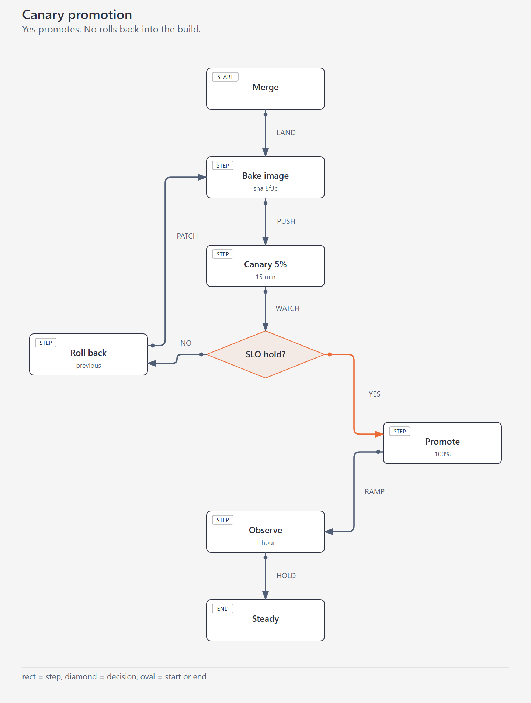
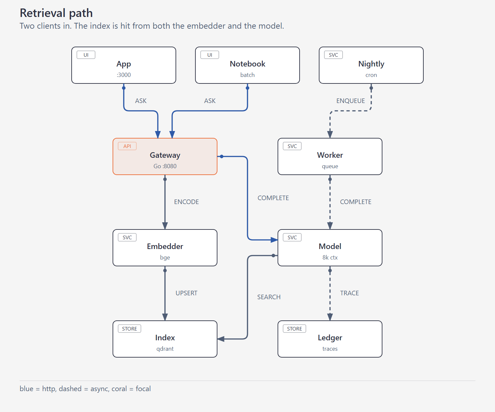
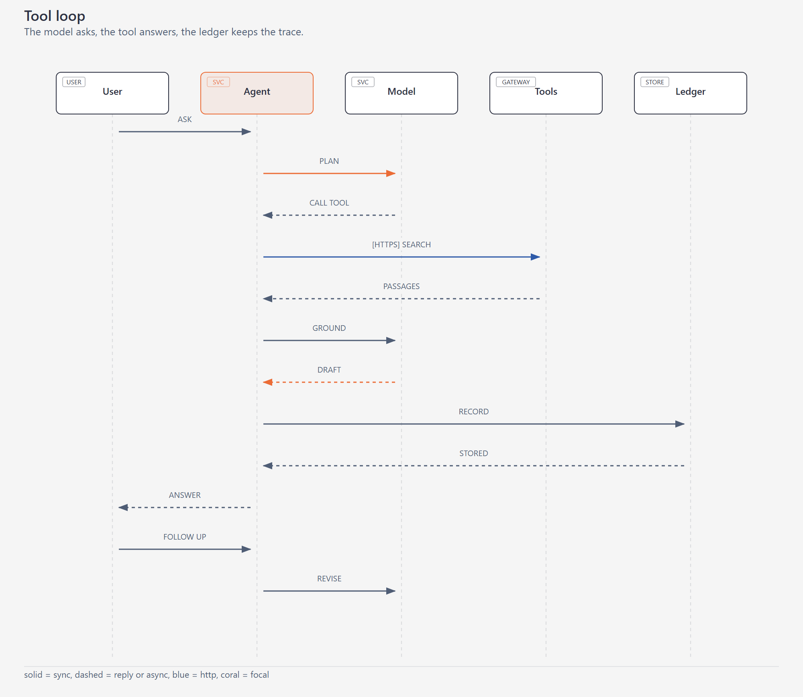
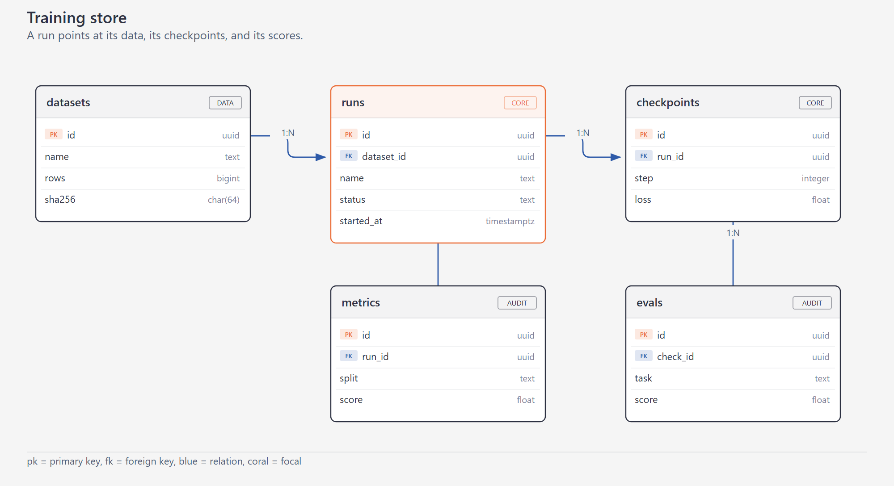
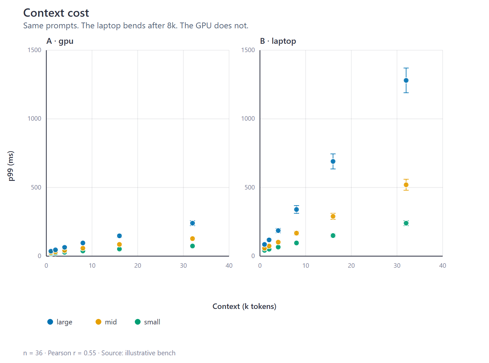
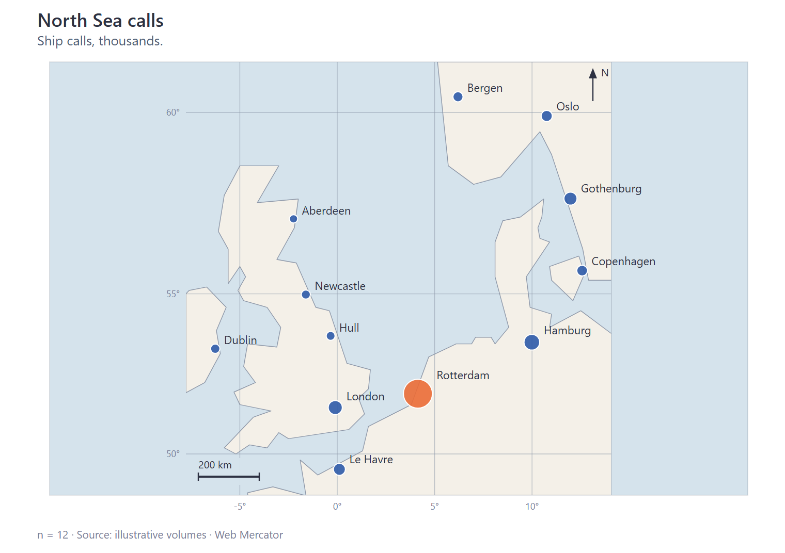

# graphflow

Graphing library for agents. An agent passes a CSV or a JSON spec. The library checks the spec, draws the figure, and checks the SVG before the agent shows it.

The program is `graph.py`. It uses the Python 3 standard library only. Install it by cloning this repository.

## Install

```bash
git clone https://github.com/lucas19919/graphflow.git
```

Windows:

```powershell
py -3 graphflow\graph.py describe
```

Elsewhere:

```bash
python3 graphflow/graph.py describe
```

`describe` prints the figure types as JSON. A clean exit means the library is ready.

Agents should follow `.agents/skills/graphflow-install/SKILL.md`. That skill clones the repository to a stable path, runs the check above, and copies the drawing skill into the agent's user skills folder. Drawing after install is `.agents/skills/graph-engine/SKILL.md`.

## Figures

| Command | Input | Draws |
| --- | --- | --- |
| `flow` | JSON | A decision flow |
| `arch` | JSON | Services and the calls between them |
| `seq` | JSON | A sequence of messages |
| `schema` | JSON | Tables and their relations |
| `bar` | CSV | A comparison across categories |
| `line` | CSV | A trend |
| `scatter` | CSV | Two numeric columns, with groups, error bars, and facets |
| `geo` | CSV or GeoJSON | Places on a built-in coastline |

`describe <type>` is the contract for that type: fields, flags, and size limits.

## Agent loop

Run these in order. Chain on the exit code.

```text
describe   read the contract for the type
validate   check the spec or CSV          exit 0 required
render     flow, arch, seq, schema, bar, line, scatter, or geo
audit      check the SVG                  exit 0 required
export     write png, pdf, or svg
```

When a check fails, change the spec or the flags and render again. Leave the SVG alone.

Command recipes and size limits live in [`SKILL.md`](SKILL.md). The skill an agent loads to draw is [`.agents/skills/graph-engine/SKILL.md`](.agents/skills/graph-engine/SKILL.md).

## Output

| File | Contents |
| --- | --- |
| `OUT.html` | The figure, plus Copy SVG, Export SVG, and Export PNG. Print hides that bar. |
| `OUT.svg` | The same drawing. The title and subtitle are on the figure. |
| `OUT.graph.json` | The receipt. `export` redraws from it. |

## Example

```powershell
py -3 graph.py validate examples/show_canary.json
py -3 graph.py flow examples/show_canary.json -o out/canary.html
py -3 graph.py audit out/canary.svg
py -3 graph.py export out/canary.html --to png -o out/canary.png
```

## MCP

```powershell
py -3 graph.py mcp
```

This speaks MCP over stdio. The tools are `describe`, `validate`, `infer`, `audit`, `scatter`, `diagram`, `bar`, and `line`. Geo, gridlines, markers, and highlights are flags on the CLI.

## Tests

```powershell
py -3 tests_smoke.py
```

Exit 0 means every check passed.

## Requirements

- Python 3
- Git, to clone
- PNG and PDF export uses cairosvg when that module imports. Otherwise it uses headless Microsoft Edge or Google Chrome. SVG export needs neither.

## License

[MIT](LICENSE)

## Gallery

The counts and latencies in these figures are made up so the shapes are easy to read.












